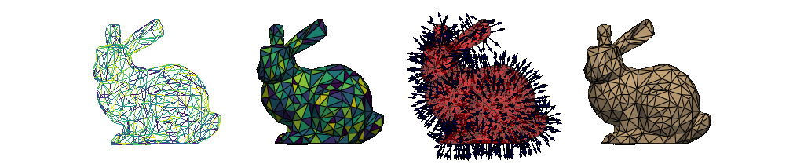

# **SigmaEpsilon.Mesh** - Data Structures, Computation and Visualization for Complex Polygonal Meshes in Python

The [sigmaepsilon.mesh](https://sigmaepsilon.mesh.readthedocs.io/en/latest/) library aims to provide the tools to build and analyse poligonal meshes with complex topologies. Meshes can be built like a dictionary, using arbitarily nested layouts and then be translated to other formats including [VTK](https://vtk.org/) and [PyVista](https://docs.pyvista.org/). For plotting, there is also support for [K3D](http://k3d-jupyter.org/), [Matplotlib](https://matplotlib.org/) and [Plotly](https://plotly.com/python/).

The data model is built around [Awkward](https://awkward-array.org/doc/main/), which makes it possible to attach nested, variable-sized data to the points or the cells in a mesh, also providing interfaces to other popular libraries like [Pandas](https://vtk.org/) or [PyArrow](https://arrow.apache.org/docs/python/index.html). Implementations are fast as they rely on the vector math capabilities of [NumPy](https://numpy.org/doc/stable/index.html), while other computationally sensitive calculations are JIT-compiled using [Numba](https://numba.pydata.org/).

Here and there we also use [NetworkX](https://networkx.org/documentation/stable/index.html#), [SciPy](https://scipy.org/), [SymPy](https://www.sympy.org/en/index.html) and [scikit-learn](https://scikit-learn.org/stable/).

## Highlights

* Classes to handle points, pointclouds, reference frames and jagged topologies.
* Array-like mesh composition with a Numba-jittable database model. Join or split meshes, attach numerical data and save to and load from disk.
* Simplified and preconfigured plotting facility using PyVista.
* Grid generation in 1, 2 and 3 dimensions for arbitrarily structured Lagrangian cells.
* A mechanism for all sorts of geometrical and topological transformations.
* A customizable nodal distribution mechanism to effortlessly pass around data between points and cells.
* Generation of *Pseudo Peripheral Nodes*, *Rooted Level Structures* and *Adjancency Matrices* for arbitrary polygonal meshes.
* Symbolic shape function generation for arbitrarily structured Lagrangian cells in 1, 2 and 3 dimensions with an extendible interpolation and extrapolation mechanism.
* Connections to popular third party libraries like `networkx`, `pandas`, `vtk`, `PyVista` and more.
* The ability to read from a wide range of formats thanks to the combined power of `vtk`, `PyVista` and `meshio`.
